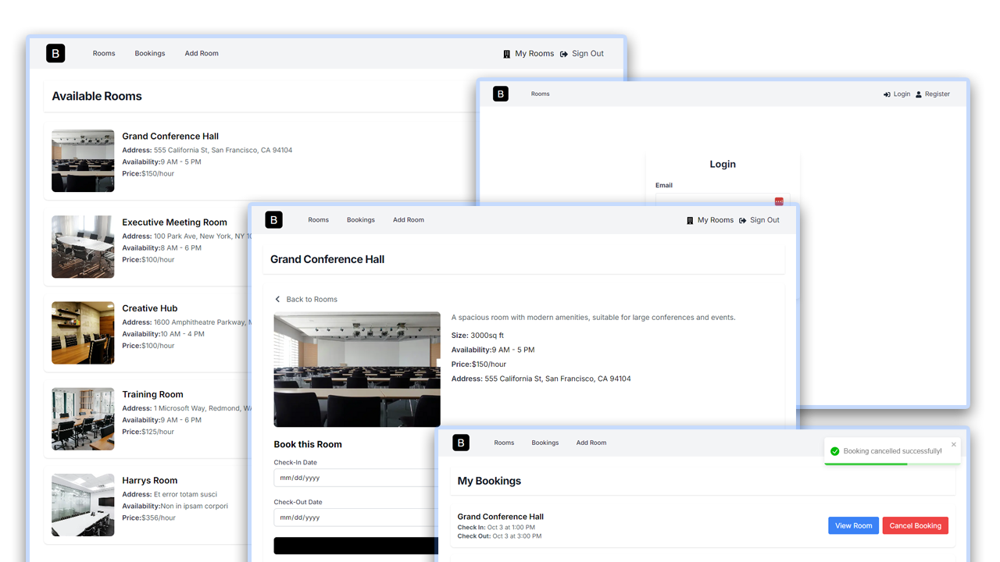

# Bookit App

Meeting room booking application built with Next.js, Appwrite, and Tailwind CSS.


#### Live App

[https://booking-app-pied-pi.vercel.app/]

## Usage

#### Install Dependencies

```bash
npm install
```

#### Run the development server:

```bash
npm run dev
```

Open [http://localhost:3000](http://localhost:3000) with your browser.

#### Appwrite Setup & Environment Variables

App connected to Database | Appwrite

[https://cloud.appwrite.io/console](Appwrite console)
